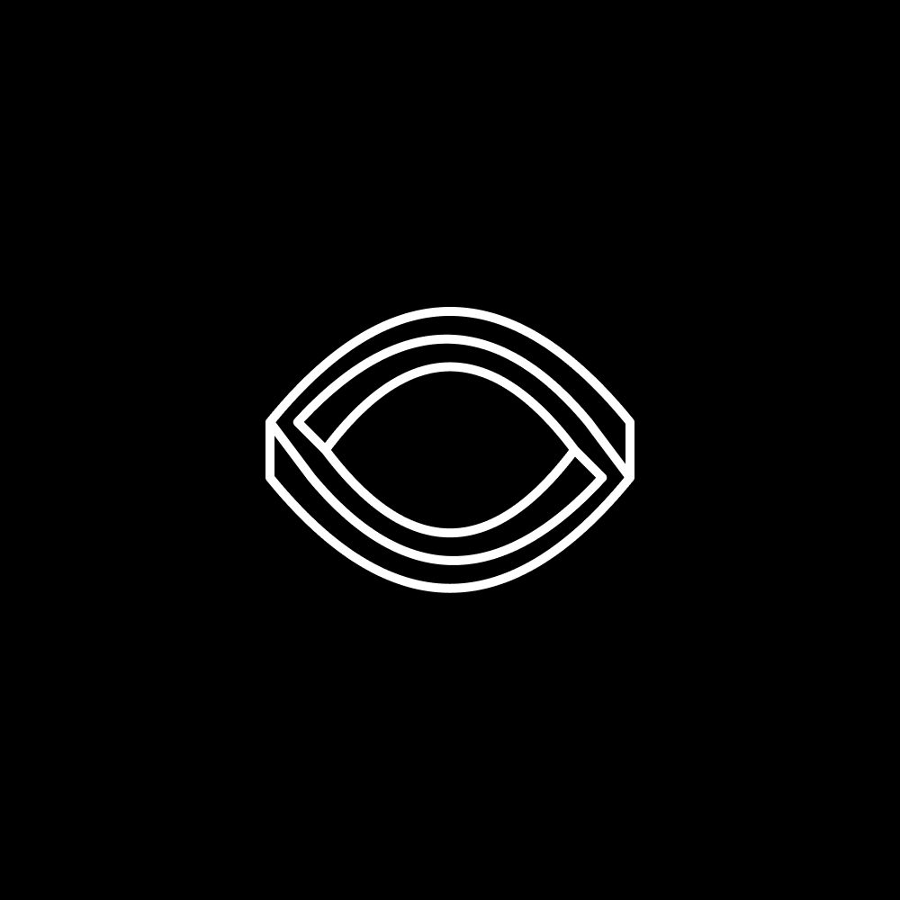

#

<div align="center">

  
  <h1>Ideal</h1>

  <p>
    The ideal golang project template for newbies.
  </p>

<!-- Badges -->

[](https://pkg.go.dev/github.com/Mikaayenson/ideal)

<h5>
    <a href="https://github.com/Mikaayenson/ideal/issues/">Report Bug</a>
  <span> · </span>
    <a href="https://github.com/Mikaayenson/ideal/pulls/">Request Feature</a>
  </h5>
</div>

<br />

<!-- About the Project -->
## :star2: About the Project

Sometimes people just want to create a new project in go but aren't sure the how to get started. This project is designed to be the ideal template inspired by [12-factors](https://12factor.net) for go projects with a bit of flair. It's also a fun way to learn go conventions.

<!-- Screenshots -->
### :camera: Screenshots

<p align="center">
  TODO Add Image
</p>

<!-- TechStack -->
### :space_invader: Tech Stack

<details>
  <summary>ideal</summary>
  <ul>
    <li><a href="https://go.dev">golang</a></li>

  </ul>
</details>

<details>
<summary>DevOps</summary>
  <ul>
    <li><a href="https://www.docker.com/">Docker</a></li>
    <li><a href="https://github.com/features/actions">GitHub Actions</a></li>
  </ul>
</details>

<!-- Features -->
### :dart: Features

- TODO Add Features
<!-- Config Variables -->
### :key: Config Variables

- `TODO` : Add Config Variables

<!-- Getting Started -->
## :toolbox: Getting Started

<!-- Prerequisites -->
### :bangbang: Prerequisites

This project uses poetry as the python package manager

- `TODO` Add Install Guide

<!-- Run Locally -->
### :running: Run Locally

TODO: Add GIF

Clone the project

```bash
  git clone git@github.com:Mikaayenson/ideal.git
```

Go to the project directory

```bash
  cd ideal
```

Install dependencies

```bash
  TODO Add dependencies
```


Run ideal

```bash
  ideal --help
```

<!-- Running Tests -->
### :test_tube: Running Tests

Run tests

```bash
  go test
```

<!-- Build: Poetry -->
### :triangular_flag_on_post: Build: Go Package

Build this project

```bash
  go build
```

<!-- Build: Docker-->
### :triangular_flag_on_post: Build: Docker Container

Build this project as a `docker container`


```bash
  docker build --tag ideal_image
```

Run the `ideal` commands

```bash
  docker run --rm ideal_image ideal version
```

<!-- Usage -->
## :eyes: Usage


```bash
  # Run the ideal command
  ideal do stuff
```

<!-- Roadmap -->
## :compass: Lessons Learned & Roadmap

- [ ] TODO Add lessons learned

<!-- FAQ -->
## :grey_question: FAQ

- TODO: Add FAQ

<!-- License -->
## :warning: License

Distributed under the MIT License. See LICENSE.txt for more information.

<!-- Contact -->
## :handshake: Contact

Mika Ayenson - [@mikaayenson](https://github.com/Mikaayenson)

<!-- Acknowledgments -->
## :gem: References

1. [Selecting a Package Name](https://go.dev/blog/package-names)
2. Leverage an [Awesome Readme Template](https://github.com/Louis3797/awesome-readme-template/blob/main/README.md)
3. Start organizing [Package Layout](https://github.com/golang-standards/project-layout)
4. Add [Config Mangement](https://github.com/spf13/viper)
5. Add [Log Management](https://github.com/sirupsen/logrus)
6. TODO Add More References